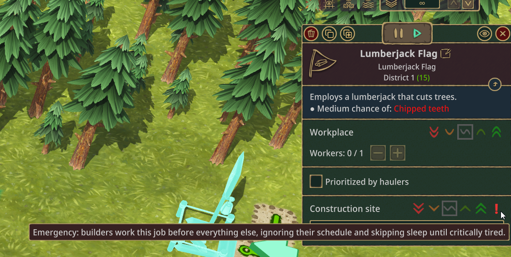
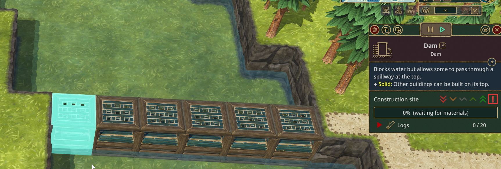

# Emergency Priority

Adds a sixth priority level — **Emergency** — above Very High for construction sites. When something absolutely has to be finished, no matter the cost, this is the override.

## What it does

Tick the red **!** on any unfinished construction site to mark it Emergency. Builders employed at a Builder Hub or District Center will then:

- Drop their current job and route to the emergency site first, regardless of normal priority order.
- Keep working past their normal shift instead of going off-duty at dusk.
- Sleep on the spot at the worksite rather than walking home to bed.
- Grab the closest food or water when hunger or thirst hits critical levels, rather than walking to their preferred source.

The base game's critical-needs handling still runs above all of this, so beavers won't die — they'll pass out before reaching that point. Clearing the Emergency flag immediately returns the building to its normal priority and the builders to their regular schedule.

## When to use it

### Beating an incoming drought or badwater

A levee with gaps, two cycles before badwater hits, and your builders decide to call it quits for the night. Flag every dam tile Emergency and your colony focuses on the wall until it's done.

### Rush B-eaver! achivement

Achievements like Rush B-eaver don't leave room for wasted shifts. Use Emergency on the buildings that gate your next milestone — the science lab you need online, the food source that unblocks expansion — and recover the hours your builders would otherwise spend off-duty.

### Anything else where finishing now is worth a tired beaver

A windmill before a drought cuts off power, a diversion system before the next badtide arrives, a power line to keep a critical industry running. If the cost of being late is worse than the cost of one rough shift, Emergency is the right tool.

## Use sparingly

Beavers on Emergency duty push their needs deep into the red before stopping. They won't die, but they will be exhausted and unhappy by the time the job is done. Emergency is meant for short, focused pushes — flag the buildings that genuinely need it, then unflag them once the job is done. Leaving everything Emergency permanently turns a rescue tool into a colony-wide grindstone.

## Make sure you have the materials

While *any* Emergency site is unfinished, builders will refuse to start *any* normal-priority construction. They reserve themselves for the emergency. But it means **if you flag a site Emergency and you don't have the materials to finish it, every construction project in your colony stops** until either the materials show up or you unflag the Emergency.

This bites hardest with goods that take time to produce — planks, gears, metal blocks. If you flag an Emergency that needs 30 planks and your sawmills are sitting at zero stock, your builders will deliver what little they can, then idle (or eat / sleep on the spot) waiting for more. Meanwhile that quality-of-life housing you were halfway through? Untouched.

Before flagging Emergency, confirm:
1. The materials the site needs are already in a warehouse, OR
2. You're actively producing them and the wait will be short.

If you flag and then realize you can't finish it, just unflag the Emergency — your colony resumes normal construction immediately.

## Installation

1. Subscribe on Steam Workshop, or drop the mod folder into `Documents/Timberborn/Mods/`.
2. Make sure the **Harmony** mod is installed — it's a required dependency. The mod manager will warn you if it's missing.
3. Launch the game. Select any construction site and the **!** toggle will be in the priority row.

No new buildings, no new tech tree entries, no extra menus. The toggle just appears alongside the priorities you already use.

## How it works

Emergency is layered on top of the existing five-level priority system, not a replacement for it. Each construction site carries an additional Emergency flag. Behavior overrides are scoped narrowly:

- The construction-job override only fires for builders when at least one Emergency site exists.
- The schedule and sleep overrides only fire for those same builders.
- The closest-food override only fires when the beaver is already in actual critical need state.

Non builder beavers behave identically to vanilla.

